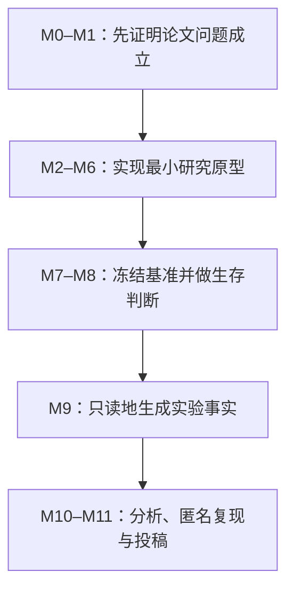
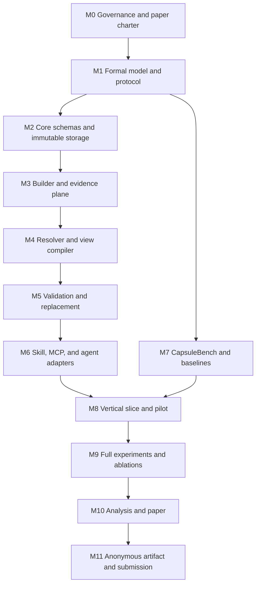

# ContractCapsule FSE 2027 模块化执行与研究计划

> **For agentic workers:** REQUIRED SUB-SKILL: Use `superpowers:executing-plans` to implement this plan task-by-task. Steps use checkbox (`- [ ]`) syntax for tracking. The execution owner is Codex; human authors retain the approval gates explicitly marked below.

**Goal:** Build and empirically evaluate ContractCapsule v2.1 as a verifiable context-replacement mechanism for coding agents, then submit a double-anonymous FSE 2027 Research Paper with a reproducible artifact.

**Architecture:** Preserve the frozen `CCS-2.1` core as an immutable, source-grounded capsule; compile task-specific runtime views through a deterministic resolver and validator; expose the system through a CLI, MCP gateway, Skill, and Codex/Claude adapters. The paper contribution is the definition, mechanism, benchmark, and empirical evidence for *verifiable context replacement*, not a general-purpose context-management product.

**Tech Stack:** Python 3.12, Pydantic 2, SQLite/FTS5, filesystem CAS with SHA-256, NetworkX, Typer, MCP Python SDK, pytest, Hypothesis, pandas, SciPy, statsmodels, Matplotlib/Seaborn, Codex CLI non-interactive mode, Claude Code non-interactive mode, LaTeX `acmart`.

## 中文执行总纲

本文件采用“中文决策层 + Codex 精确任务层”的双层写法。本节用于作者快速审查方向；后续英文任务清单保留固定的类型名、路径、命令和验收语句，供 Codex 无歧义执行。两层内容发生冲突时，以冻结的 `CCS-2.1` 规范、FSE 官方要求和后文可执行验收门为准。

### 最终目的

唯一一级目标是：在 **2026-10-02 AoE** 前形成一篇有真实系统、可信实验和匿名复现包支撑的 FSE 2027 Research Paper。插件、Skill、MCP 服务和 CLI 都只是用来生成论文证据的研究载体，不是当前阶段的独立商业目标。

论文要回答的核心问题不是“怎样多存一些上下文”，而是：

> 当项目上下文从旧版本切换到新版本时，能否同时证明目标行为已经改变、受保护行为没有被破坏、无关行为没有发生外溢，并且每项注入信息都能回到不可变原文证据？

因此，以下三项优先级不可颠倒：

1. 先冻结可证伪的研究主张、基线、指标和实验协议；
2. 再实现刚好足以检验主张的研究原型；
3. 最后才考虑可视化编辑器、市场发布、云部署等产品化工作。

### Codex 的执行边界

Codex 是模块执行人，负责写代码、测试、实验脚本、可复现分析和论文初稿，但不能代替作者作以下决定：

- 确认作者名单、利益冲突、伦理审批和投稿元数据；
- 把 Codex 生成的任务标签、行为契约或测试直接视为真实标注；
- 在实验结果不支持时保留原主张；
- 绕过停止门、修改冻结后的原始数据或补造结果；
- 作为论文作者，或替作者承担引文、数据和结论责任。

每个模块必须遵守同一循环：

```text
读取冻结输入 → 先写失败测试 → 最小实现 → 运行验证
→ 记录 AI 使用与工件摘要 → 更新主张—证据矩阵 → 停在人工门
```

### 十二个顺序模块

| 模块 | 日期 | Codex 必须交付 | 通过条件 |
|---|---:|---|---|
| M0 研究治理与仓库初始化 | 07-30—08-02 | 论文章程、FSE 规则锁、AI 使用台账、规格摘要锁 | 作者确认赛道、作者/冲突/伦理和规格摘要 |
| M1 形式模型与预注册协议 | 08-03—08-07 | 胶囊与替换关系、失效语义、RQ、指标、基线、分析协议 | 主张能与压缩/RAG/普通记忆明确区分，否则停止 |
| M2 规范模型与不可变存储 | 08-08—08-12 | 七模块 Schema、CAS、Registry、语义版本和摘要 | 核心变一字即换摘要；已发布核心不可覆盖 |
| M3 Builder 与证据链 | 08-13—08-16 | 原文快照、语义原子、source-map、信任分级、隔离区 | 未验证的 Agent 观察不能进入 P0/P1 |
| M4 Resolver 与 View Compiler | 08-17—08-21 | 准入、排序、依赖闭包、冲突、P0–P4 预算、View Manifest | P0 召回 100%；无权限内容即使高相关也不可进入 |
| M5 替换与验证 | 08-22—08-24 | 行为契约、双运行、原子激活、安全边界和回滚 | 不安全候选始终不激活；安全候选可激活并回滚 |
| M6 Agent 接入 | 08-25—08-26 | ContractCapsule Skill、MCP、Codex/Claude 适配器、风险 Hook | 完成一次构建→编译→双运行→替换→回滚垂直切片 |
| M7 CapsuleBench | 08-27—09-01 | 24 个任务、六个条件、客观评分器、实验 Harness | 所有任务旧状态可复现；标注经人工确认且评分器盲于条件 |
| M8 预实验与生存门 | 09-02—09-06 | 预实验结果、成本/时长估计、泄漏检查、协议冻结 | 选择继续、缩小主张或延期；不得因赶截稿而放行 |
| M9 正式实验 | 09-07—09-14 | 828 次计划运行、日志、摘要、失败记录和只读原始数据 | 每个计划单元有结果或显式基础设施失败记录 |
| M10 分析与论文 | 09-15—09-24 | 统计、图表、失败案例、18 页完整论文 | 每个数字由脚本生成并能回到 run ID |
| M11 匿名复现包与投稿 | 09-25—10-01 | 匿名工件、干净环境复现、引用/匿名/页数审计、PDF | 作者批准，最迟 10-01 上传，保留一天缓冲 |

模块依赖是硬约束：



### 冻结后的研究设计

主实验固定比较六种条件：

| 条件 | 含义 |
|---|---|
| B0 Native Agent | Agent 默认的项目发现与上下文能力 |
| B1 Full Context | 在统一预算内直接注入完整授权文档 |
| B2 RAG | 先做权限过滤，再检索 Top-k 片段 |
| B3 Summary | 在相同预算下使用有来源的压缩摘要 |
| B4 Atom Only | 有原子和证据，但无依赖闭包、替换契约与交换控制 |
| CC ContractCapsule | 完整 `CCS-2.1` |

实验量固定为：

- Codex 主实验：24 个任务 × 6 个条件 × 3 次重复 = **432 次**；
- Claude Code 分层复现：12 个任务 × 6 个条件 × 3 次重复 = **216 次**；
- Codex 消融实验：12 个任务 × 5 个配置 × 3 次重复 = **180 次**；
- 合计 **828 次 Agent 运行**，不含预检和纯基础设施失败重试。

论文必须分别报告：

- `TER`：目标效果是否真正实现；
- `PIP`：声明要保护的不变量是否仍成立；
- `BSR`：不应变化的行为发生了多少外溢；
- 任务/契约测试通过率、强制约束遵守率；
- 输入 Token、缓存 Token（供应商可提供时）、时延与成本；
- 原子选择精确率/召回率、关键原子召回、来源解析率和精确展开成功率。

`RCS = TER × PIP × (1-BSR)` 只能作为辅助描述，不能用一个综合分掩盖任一失败维度。

### 三个绝对停止门

1. **08-07 新颖性门：** 如果贡献仍可被概括为“摘要加元数据”，停止编码并重写主张。
2. **09-06 生存门：** 如果垂直切片不稳定、基准没有客观真值、条件泄漏或预算不可承受，缩小研究问题或延期，不提交弱证据。
3. **09-28 冻结门：** 如果引用、匿名、复现、页数或数据追溯任一失败，不进入投稿上传阶段。

任何进度延期优先删除产品化范围和次要分析，不能删除 RQ3 的替换安全性证据，不能降低 P0、证据、权限、依赖、完整性或行为契约门禁。

## Global Constraints

- The only normative design source is `CCS-2.1`, frozen on 2026-07-30.
- The expected SHA-256 of the approved source specification is `aaddaa8def8df1ef2efbe4f9487de0ba86a60ae5aed8955ca76f5e070fa01e5c`; M0 must stop if the supplied file differs.
- Published capsule cores are immutable; changes create a new semantic version.
- Lossy summaries never replace or overwrite source evidence.
- Authorization, repository scope, source freshness, and trust checks run before relevance ranking.
- P0 atoms are exact, mandatory, and never silently compressed or dropped.
- Selected atoms include their mandatory dependency closure.
- Every injected formal atom resolves to source evidence.
- Unresolved conflicts, integrity failures, missing mandatory dependencies, or failed behavioral contracts block activation.
- Generated observations enter quarantine and never modify a published capsule in place.
- The prototype must compile the same capsule for Codex and Claude Code.
- The research prototype uses local SQLite plus filesystem CAS; distributed cloud storage, production UI, marketplace publication, billing, and enterprise multi-tenancy are outside the FSE 2027 critical path.
- Every AI-assisted research action that affects code, datasets, experiments, analyses, figures, or conclusions is recorded in `research/ai-usage-ledger.jsonl`.
- FSE authors—not Codex—remain accountable for data, citations, claims, ethics, and submission.

---

## 1. Submission target and non-negotiable dates

Target: **FSE 2027 Research Papers**, Shenzhen, China, 12–16 July 2027.

Official constraints:

- Full paper submission: **Friday, 2 October 2026, AoE (UTC−12)**.
- Author response: 14–18 December 2026.
- Initial notification: 22 January 2027.
- Major revision deadline: 5 March 2027.
- Final notification: 31 March 2027.
- Initial submission: at most **18 pages of text and figures plus 4 pages of references**.
- Format: `\documentclass[acmsmall,screen,review,anonymous]{acmart}`.
- Review: heavy double-anonymous.
- A `Data Availability` statement is required after the conclusion.
- An anonymized replication package is expected when possible.
- AI use affecting research design, implementation, datasets, experiments, analysis, validation, or research artifacts must be described in the methods section.

Internal dates:

| Gate | Internal deadline | Required state |
|---|---:|---|
| G0: claim and protocol freeze | 2026-08-07 | RQs, contribution boundary, metrics, benchmark schema fixed |
| G1: vertical research slice | 2026-08-26 | one real task completes build → compile → execute → replace → rollback |
| G2: benchmark and pilot freeze | 2026-09-05 | benchmark v1.0, baselines, pilot report, cost estimate |
| G3: submission viability decision | 2026-09-06 | proceed, narrow claims, or defer rather than submit weak evidence |
| G4: primary experiment complete | 2026-09-14 | raw results checksummed and read-only |
| G5: analysis and figures freeze | 2026-09-19 | statistical report, plots, ablations, failure analysis |
| G6: complete paper draft | 2026-09-24 | all 18-page sections populated with verified results |
| G7: anonymous artifact and paper freeze | 2026-09-28 | external-style review, anonymity audit, artifact smoke test |
| Submission buffer | 2026-09-29—2026-10-01 | formatting, metadata, upload validation |

Codex must aim to submit-ready freeze by 2026-09-28. The official deadline is not the working deadline.

---

## 2. Paper-first thesis

### 2.1 One-sentence thesis

> Coding-agent project context should be managed as immutable, source-grounded, contract-bearing replacement units whose task-specific runtime views and behavioral substitutions can be audited and validated.

### 2.2 Working title

**ContractCapsule: Verifiable Context Replacement for Coding Agents**

### 2.3 Contributions to defend

| Contribution | Required evidence |
|---|---|
| C1. A formal context-capsule and replacement model | definitions, invariants, compatibility relation, replacement preconditions |
| C2. A working CCS-2.1 research prototype | builder, registry, resolver, compiler, validator, swap controller, two agent adapters |
| C3. CapsuleBench, a benchmark for context replacement | public-repository tasks, old/new capsules, target effects, protected invariants, executable tests |
| C4. An empirical comparison against context baselines | effectiveness, token use, traceability, replacement safety, robustness |
| C5. Open and reproducible research artifacts | anonymized package, locked configs, raw results, analysis scripts, AI-use ledger |

### 2.4 Explicit novelty boundary

The paper must not claim that typed atoms, context compression, provenance, RAG, memory tiers, or Skill/MCP integration are independently new.

The paper claims novelty in their integration around **replacement correctness**:

\[
C_{\mathrm{old}} \xRightarrow[\text{contract, evidence, closure}]{\text{validated replacement}} C_{\mathrm{new}}
\]

The replacement succeeds only when:

1. the intended target effect is realized;
2. declared protected invariants remain satisfied;
3. forbidden spillover does not occur;
4. all mandatory dependencies remain closed;
5. the runtime view is traceable to immutable evidence;
6. activation is atomic and the prior version remains recoverable.

---

## 3. Research questions and measures

### RQ1 — Task effectiveness and efficiency

**Question:** Does ContractCapsule improve or preserve coding-task success while reducing irrelevant context compared with native context, full-context injection, RAG, summary compression, and atom-only context?

Primary measures:

- repository test pass rate;
- contract test pass rate;
- task completion rate;
- mandatory-constraint adherence rate;
- input tokens;
- cached input tokens where reported;
- wall-clock duration;
- reported provider cost where available.

### RQ2 — Explainability and evidence fidelity

**Question:** Can users reliably determine which context influenced a task and recover the corresponding source evidence?

Measures:

- gold-atom selection precision and recall;
- critical-atom recall;
- provenance resolution rate;
- source-span correctness;
- view-manifest decision completeness;
- exact-source expansion success rate;
- stale-source detection rate.

### RQ3 — Replacement correctness and safety

**Question:** Does ContractCapsule replace project context with fewer unintended behavioral changes than competing representations?

Measures:

- Target Effect Realization (`TER`);
- Protected Invariant Preservation (`PIP`);
- Behavioral Spillover Rate (`BSR`);
- dependency-closure success;
- conflict-detection rate;
- unsafe activation rate;
- rollback success rate.

Report `TER`, `PIP`, and `BSR` separately. A secondary descriptive score may be calculated as:

\[
RCS = TER \times PIP \times (1-BSR)
\]

The composite must not replace the individual results.

### RQ4 — Generality and component necessity

**Question:** Do results generalize across coding agents and which CCS-2.1 mechanisms are necessary?

Evidence:

- primary Codex experiment;
- stratified Claude Code replication;
- ablations without dependency closure, behavioral contracts, evidence expansion, or risk-aware compression;
- results split by task category, language, repository, and risk.

---

## 4. Experimental conditions

### 4.1 Primary systems

| ID | Condition | Context supplied |
|---|---|---|
| B0 | Native Agent | repository and default agent discovery only |
| B1 | Full Context | complete authorized task documents within a common context budget |
| B2 | RAG | permission-filtered BM25 + embedding top-k chunks |
| B3 | Summary | source-grounded LLM summary under the same view budget |
| B4 | Atom Only | typed source-grounded atoms without dependency graph, replacement contract, or swap controller |
| CC | ContractCapsule | complete CCS-2.1 system |

### 4.2 Ablations

| ID | Removed mechanism | Hypothesis tested |
|---|---|---|
| A1 | mandatory dependency closure | whether context dependencies prevent incomplete decisions |
| A2 | replacement contract | whether protected invariants reduce behavioral spillover |
| A3 | source-map expansion | whether exact evidence recovery improves correctness and auditability |
| A4 | P0–P4 risk-aware compression | whether uniform compression hides critical constraints |

### 4.3 Run matrix

Primary Codex study:

- 24 tasks;
- 6 conditions;
- 3 independent runs per task-condition;
- total: 432 runs.

Cross-agent Claude Code replication:

- 12 stratified tasks;
- 6 conditions;
- 3 runs per task-condition;
- total: 216 runs.

Ablation study:

- 12 stratified tasks;
- 4 ablations plus full CC;
- Codex only;
- 3 runs per task-condition;
- total: 180 runs.

Planned total: **828 agent runs**, excluding preflight and failed-infrastructure retries.

Retries caused by provider or infrastructure failure are logged separately and do not replace valid unfavorable outcomes.

---

## 5. Benchmark design

CapsuleBench v1.0 contains:

- 24 tasks from at least 8 permissively licensed public repositories;
- at least three programming-language ecosystems;
- task categories:
  - policy or invariant migration;
  - API/interface evolution;
  - architecture-decision replacement;
  - procedure/build/deployment convention replacement;
- paired old and new capsule versions;
- executable target-effect tests;
- executable protected-invariant tests;
- forbidden-spillover checks;
- gold relevant atoms and source spans;
- a frozen repository commit for every task.

Each benchmark task has this structure:

```text
benchmark/tasks/<task_id>/
├── task.yaml
├── repository.lock
├── prompt.md
├── capsules/
│   ├── old/
│   └── new/
├── gold/
│   ├── required-atoms.json
│   ├── target-effects.yaml
│   ├── protected-invariants.yaml
│   └── forbidden-spillover.yaml
├── tests/
│   ├── target/
│   ├── invariant/
│   └── spillover/
└── licenses/
    └── provenance.json
```

Task inclusion rules:

- source repository has a clear license;
- the relevant old/new context is recoverable from immutable commits;
- the task can execute in an isolated environment;
- target effects and protected invariants are objectively testable;
- no private or confidential data;
- the task does not require unavailable paid infrastructure;
- native execution completes within 15 minutes after setup;
- total checked-out repository size is below 2 GiB.

Ground-truth rules:

- Codex may extract candidate atoms and tests.
- A human author verifies every task’s target effect and protected invariants against source evidence.
- At least 25% of tasks receive a second independent human review.
- Disagreements are recorded in `benchmark/adjudication.jsonl`.
- Codex-generated labels are never treated as ground truth without human approval.

---

## 6. Repository and file map

Create a new Git repository named `contract-capsule`:

```text
contract-capsule/
├── AGENTS.md
├── README.md
├── LICENSE
├── CITATION.cff
├── pyproject.toml
├── uv.lock
├── .gitignore
├── .codex/
│   ├── config.toml
│   └── hooks/
│       └── pre_tool_use.py
├── docs/
│   ├── spec/
│   │   └── CCS-2.1.md
│   ├── adr/
│   │   ├── 0001-paper-first-scope.md
│   │   ├── 0002-local-cas-sqlite.md
│   │   └── 0003-replacement-boundary.md
│   └── protocol/
│       ├── formal-model.md
│       └── failure-semantics.md
├── src/contractcapsule/
│   ├── __init__.py
│   ├── cli.py
│   ├── models/
│   │   ├── manifest.py
│   │   ├── atom.py
│   │   ├── evidence.py
│   │   ├── graph.py
│   │   ├── contract.py
│   │   ├── policy.py
│   │   └── view.py
│   ├── storage/
│   │   ├── cas.py
│   │   └── registry.py
│   ├── build/
│   │   ├── ingest.py
│   │   ├── atomize.py
│   │   └── publish.py
│   ├── resolve/
│   │   ├── eligibility.py
│   │   ├── rank.py
│   │   ├── closure.py
│   │   └── conflicts.py
│   ├── compile/
│   │   ├── budget.py
│   │   ├── compiler.py
│   │   └── renderers.py
│   ├── validate/
│   │   ├── integrity.py
│   │   ├── evidence.py
│   │   ├── compression.py
│   │   └── behavior.py
│   ├── swap/
│   │   ├── controller.py
│   │   └── twin_run.py
│   ├── adapters/
│   │   ├── base.py
│   │   ├── codex.py
│   │   └── claude.py
│   ├── mcp/
│   │   └── server.py
│   └── audit/
│       ├── ledger.py
│       └── quarantine.py
├── skills/
│   └── contract-capsule/
│       ├── SKILL.md
│       └── references/
│           └── CCS-2.1-summary.md
├── schemas/
│   ├── manifest.schema.json
│   ├── atom.schema.json
│   ├── evidence.schema.json
│   ├── replacement-contract.schema.json
│   └── view-manifest.schema.json
├── tests/
│   ├── unit/
│   ├── property/
│   ├── integration/
│   ├── security/
│   └── fixtures/
├── benchmark/
│   ├── README.md
│   ├── benchmark-manifest.json
│   ├── tasks/
│   └── adjudication.jsonl
├── baselines/
│   ├── native.py
│   ├── full_context.py
│   ├── rag.py
│   ├── summary.py
│   └── atom_only.py
├── experiments/
│   ├── configs/
│   │   ├── agents.yaml
│   │   ├── conditions.yaml
│   │   └── study.yaml
│   ├── preflight.py
│   ├── run.py
│   ├── retry_infrastructure.py
│   ├── score.py
│   └── freeze.py
├── analysis/
│   ├── build_dataset.py
│   ├── statistics.py
│   ├── plots.py
│   └── tables.py
├── research/
│   ├── claim-evidence-matrix.md
│   ├── protocol.md
│   ├── literature.csv
│   ├── ai-usage-ledger.jsonl
│   ├── risks.md
│   └── decision-log.md
├── results/
│   ├── raw/
│   ├── processed/
│   ├── figures/
│   └── tables/
├── paper/
│   ├── main.tex
│   ├── references.bib
│   ├── sections/
│   └── figures/
└── artifact/
    ├── README.md
    ├── Dockerfile
    ├── run_smoke.sh
    ├── run_analysis.sh
    └── checksums.sha256
```

All paths and commands from M0 onward are relative to the new `contract-capsule/` repository root unless a task explicitly says otherwise.

---

## 7. Module dependency graph



Codex may interleave benchmark extraction with engineering after `task.yaml` and capsule schemas are frozen, but no full experiment begins before G2.

---

## 8. Codex execution protocol

For every module:

1. Read this plan, `docs/spec/CCS-2.1.md`, the module input files, and the latest decision log.
2. Create or update a dedicated Git branch named `codex/m<N>-<short-name>`.
3. Write failing tests before implementation.
4. Make the smallest implementation that satisfies the frozen interface.
5. Run module tests and the accumulated regression suite.
6. Update `research/claim-evidence-matrix.md`.
7. Append an AI-use record to `research/ai-usage-ledger.jsonl`.
8. Produce the module report specified below.
9. Stop at the exit gate for human review.
10. Merge only after the human gate is approved.

Required AI-use record:

```json
{
  "timestamp": "ISO-8601",
  "module": "M<number>",
  "agent": "codex",
  "model_id": "value extracted from run metadata",
  "prompt_sha256": "sha256",
  "inputs": ["paths"],
  "outputs": ["paths"],
  "research_role": "implementation|dataset|experiment|analysis|writing",
  "human_validation": "pending|approved|rejected",
  "commit": "git-sha"
}
```

Codex automation should use `codex exec --ephemeral --json` where machine-readable traces are required. Every run stores stdout JSONL, stderr, exit code, repository commit, configuration hashes, and token usage.

---

## 9. Module execution details

### M0 — Research governance, repository bootstrap, and paper charter

**Dates:** 2026-07-30—2026-08-02  
**Purpose:** Turn the frozen concept into a controlled research project before writing system code.

**Files:**

- Create: repository root and file skeleton from Section 6.
- Copy: frozen specification to `docs/spec/CCS-2.1.md`.
- Create: `research/claim-evidence-matrix.md`.
- Create: `research/protocol.md`.
- Create: `research/ai-usage-ledger.jsonl`.
- Create: `paper/main.tex`.
- Test: `tests/unit/test_spec_lock.py`.

**Interfaces:**

- Produces immutable `SPEC_SHA256`.
- Produces paper contribution IDs `C1`–`C5` and research question IDs `RQ1`–`RQ4`.

- [ ] Initialize Git and Python project:

```bash
mkdir -p contract-capsule
cd contract-capsule
git init
uv init --python 3.12 --lib
uv add pydantic typer networkx pyyaml jsonschema
uv add --dev pytest pytest-cov hypothesis ruff mypy
```

- [ ] Copy the human-approved frozen specification to `docs/spec/CCS-2.1.md`; do not reformat it.
- [ ] Verify the exact frozen input before continuing:

```bash
printf '%s  %s\n' \
  'aaddaa8def8df1ef2efbe4f9487de0ba86a60ae5aed8955ca76f5e070fa01e5c' \
  'docs/spec/CCS-2.1.md' | sha256sum --check -
```

- [ ] Record the verified digest and source provenance in `research/decision-log.md`.
- [ ] Write `tests/unit/test_spec_lock.py` so CI fails if `docs/spec/CCS-2.1.md` changes without an ADR and version update.
- [ ] Add FSE page limit, anonymity, Data Availability, artifact, and AI-use requirements to `research/protocol.md`.
- [ ] Create the LaTeX skeleton with all paper sections and anonymous author metadata.
- [ ] Run:

```bash
uv run pytest tests/unit/test_spec_lock.py -v
uv run ruff check .
```

- [ ] Commit:

```bash
git add .
git commit -m "chore: bootstrap ContractCapsule FSE research project"
```

**Paper evidence:** submission protocol, transparent AI-use method, frozen-design trace.  
**Exit gate:** the human author verifies the target track, author list, conflicts, research ethics needs, and the exact specification digest.

---

### M1 — Formal model, claim matrix, and preregistered analysis protocol

**Dates:** 2026-08-03—2026-08-07  
**Purpose:** Prove there is a paper before building a product.

**Files:**

- Create: `docs/protocol/formal-model.md`.
- Create: `docs/protocol/failure-semantics.md`.
- Populate: `research/claim-evidence-matrix.md`.
- Populate: `research/literature.csv`.
- Finalize: `research/protocol.md`.
- Create: `tests/fixtures/formal_cases/`.

**Formal interfaces:**

```python
Capsule = tuple[Manifest, set[Atom], set[Evidence], DependencyGraph,
                ReplacementContract, CompressionPolicy, IntegrityBundle]

compile_view(capsules, task, principal, budget, adapter) -> CompiledView
validate_view(view, capsules, principal) -> ValidationReport
can_replace(old, new, task) -> ReplacementDecision
activate(candidate, safe_boundary) -> ActivationReceipt
rollback(receipt) -> RollbackReceipt
```

- [ ] Define capsule well-formedness, evidence preservation, eligibility-before-ranking, P0 preservation, dependency closure, conflict visibility, and atomic activation.
- [ ] Define interface compatibility and replacement correctness.
- [ ] Map every contribution to at least one system artifact, experiment, metric, and paper section.
- [ ] Build the related-work matrix with columns:

```text
work, year, representation, compression, provenance, modularity,
replacement_contract, behavioral_validation, agent_integration,
benchmark, overlap_risk, citation_verified
```

- [ ] Freeze RQ1–RQ4, primary outcomes, secondary outcomes, exclusion rules, retry rules, and statistical tests before the first full experiment.
- [ ] Write ten executable formal cases covering valid replacement, missing dependency, unresolved conflict, stale evidence, P0 overflow, unauthorized capsule, incompatible interface, failed invariant, safe rollback, and irreversible side effect.
- [ ] Run:

```bash
uv run pytest tests/fixtures/formal_cases -v
```

**Paper evidence:** Sections 2–4, formal definitions, research questions.  
**Kill gate G0:** proceed only if the claim-evidence matrix distinguishes behavioral replacement correctness from compression-only, retrieval-only, memory-only, and atom-only work. Otherwise narrow or redesign the paper before implementation.

---

### M2 — Canonical schemas, package loader, CAS, and immutable registry

**Dates:** 2026-08-08—2026-08-12  
**Purpose:** Implement the minimum canonical core that makes capsule identity and immutability testable.

**Files:**

- Create model files under `src/contractcapsule/models/`.
- Create JSON Schemas under `schemas/`.
- Create `src/contractcapsule/storage/cas.py`.
- Create `src/contractcapsule/storage/registry.py`.
- Test: `tests/unit/test_models.py`, `test_cas.py`, `test_registry.py`.
- Property tests: `tests/property/test_immutability.py`.

**Required signatures:**

```python
def load_capsule(path: Path) -> Capsule: ...
def canonical_digest(capsule: Capsule) -> str: ...
def put_blob(data: bytes, media_type: str) -> BlobRef: ...
def get_blob(digest: str, principal: Principal) -> bytes: ...
def publish(capsule: Capsule, principal: Principal) -> PublishedCapsule: ...
def get(capsule_id: str, version: str, principal: Principal) -> PublishedCapsule: ...
```

- [ ] Write failing schema tests for all seven core modules.
- [ ] Implement canonical JSON serialization and SHA-256 identity.
- [ ] Implement filesystem CAS using digest-addressed paths and atomic rename.
- [ ] Implement SQLite tables for capsule version, digest, lifecycle, scope, authority, and evidence references.
- [ ] Reject in-place mutation of a `PUBLISHED` capsule.
- [ ] Verify that Embeddings, compiled views, and runtime sidecars do not affect canonical capsule identity.
- [ ] Run:

```bash
uv run pytest tests/unit/test_models.py tests/unit/test_cas.py tests/unit/test_registry.py tests/property/test_immutability.py -v
```

**Paper evidence:** implementation architecture and immutable-artifact semantics.  
**Exit gate:** identical canonical input produces identical digest; any core byte change changes the digest; published overwrite is impossible through the public API.

---

### M3 — Builder, source-map, trust classification, and quarantine

**Dates:** 2026-08-13—2026-08-16  
**Purpose:** Build source-grounded capsules without allowing generated statements to become unverified authority.

**Files:**

- Create: `src/contractcapsule/build/ingest.py`.
- Create: `src/contractcapsule/build/atomize.py`.
- Create: `src/contractcapsule/build/publish.py`.
- Create: `src/contractcapsule/audit/quarantine.py`.
- Test: `tests/integration/test_build_pipeline.py`.
- Security tests: `tests/security/test_trust_promotion.py`.

**Required signatures:**

```python
def snapshot_source(source: SourceInput, principal: Principal) -> SourceSnapshot: ...
def extract_candidate_atoms(snapshot: SourceSnapshot) -> list[CandidateAtom]: ...
def bind_evidence(atom: CandidateAtom, snapshot: SourceSnapshot) -> EvidenceBinding: ...
def promote(candidate_id: str, approval: HumanApproval) -> ValidatedAtom: ...
def build_capsule(build_request: BuildRequest) -> DraftCapsule: ...
```

- [ ] Prefer deterministic parsing for code symbols, config, schemas, and Markdown headings.
- [ ] Place all LLM-derived atoms in quarantine with `T3` trust and `candidate` status.
- [ ] Require evidence binding and human approval before P0/P1 promotion.
- [ ] Store Git evidence as repository URI, immutable commit, path, stable symbol/heading, span digest, and blob digest.
- [ ] Detect secrets before storing or rendering evidence.
- [ ] Test source drift by modifying lines while retaining a stale line number; validation must rely on commit and digest rather than line number alone.
- [ ] Run:

```bash
uv run pytest tests/integration/test_build_pipeline.py tests/security/test_trust_promotion.py -v
```

**Paper evidence:** source fidelity and trust model for RQ2.  
**Exit gate:** no generated candidate can enter a published P0/P1 payload without evidence and recorded human approval.

---

### M4 — Eligibility resolver, dependency closure, conflicts, and view compiler

**Dates:** 2026-08-17—2026-08-21  
**Purpose:** Generate a minimal sufficient runtime view while preserving mandatory context.

**Files:**

- Create: `src/contractcapsule/resolve/*.py`.
- Create: `src/contractcapsule/compile/*.py`.
- Create: `tests/unit/test_eligibility.py`.
- Create: `tests/unit/test_dependency_closure.py`.
- Create: `tests/unit/test_budget.py`.
- Create: `tests/integration/test_compile_view.py`.

**Required signatures:**

```python
def eligible(capsule: Capsule, task: TaskContext, principal: Principal) -> Eligibility: ...
def rank_atoms(atoms: list[Atom], task: TaskContext) -> list[RankedAtom]: ...
def dependency_closure(selected: set[str], graph: DependencyGraph) -> set[str]: ...
def detect_conflicts(selected: set[str], graph: DependencyGraph) -> list[Conflict]: ...
def compile_view(request: CompileRequest) -> CompiledView: ...
```

`CompiledView` must include:

```python
class CompiledView(BaseModel):
    content: str
    manifest: ViewManifest
    validation: ValidationReport
    evidence_handles: list[EvidenceHandle]
```

- [ ] Implement eligibility checks before calling rankers.
- [ ] Implement FTS5/BM25 lexical ranking; keep embedding ranking behind a replaceable interface.
- [ ] Calculate mandatory dependency closure after initial relevance selection.
- [ ] Allocate budget in fixed P0 → P1 → P2 → P3 → P4 order.
- [ ] Fail compilation when P0 plus mandatory closure exceeds budget.
- [ ] Generate selection and exclusion reasons for every candidate atom.
- [ ] Place stable schema and P0 instructions before dynamic task content in renderers.
- [ ] Run:

```bash
uv run pytest tests/unit/test_eligibility.py tests/unit/test_dependency_closure.py tests/unit/test_budget.py tests/integration/test_compile_view.py -v
```

**Paper evidence:** compiler algorithm, RQ1 token results, RQ2 selection trace.  
**Exit gate:** P0 recall is 100% in all fixtures; no unauthorized atom appears even if it has the highest relevance score.

---

### M5 — Validation, replacement contracts, twin-run, activation, and rollback

**Dates:** 2026-08-22—2026-08-24  
**Purpose:** Implement the paper’s main novelty: bounded and behaviorally validated context replacement.

**Files:**

- Create: `src/contractcapsule/validate/*.py`.
- Create: `src/contractcapsule/swap/controller.py`.
- Create: `src/contractcapsule/swap/twin_run.py`.
- Create: `tests/integration/test_replacement.py`.
- Create: `tests/security/test_fail_closed.py`.

**Required signatures:**

```python
def validate_integrity(capsule: Capsule) -> IntegrityReport: ...
def validate_evidence(capsule: Capsule) -> EvidenceReport: ...
def validate_compression(view: CompiledView, capsules: list[Capsule]) -> CompressionReport: ...
def evaluate_contract(run: AgentRun, contract: ReplacementContract) -> ContractReport: ...
def compare_runs(old: AgentRun, new: AgentRun, contract: ReplacementContract) -> DifferentialReport: ...
def activate(candidate: CapsuleRef, boundary: SafeBoundary) -> ActivationReceipt: ...
def rollback(receipt: ActivationReceipt) -> RollbackReceipt: ...
```

- [ ] Write tests proving that target effects, protected invariants, and forbidden spillover are evaluated separately.
- [ ] Run old/new capsules against the same task, repository commit, agent adapter, and budget.
- [ ] Use an atomic registry pointer update only after all mandatory gates pass.
- [ ] Preserve the old version and activation receipt.
- [ ] Reject mid-tool-call activation.
- [ ] Model irreversible external actions as requiring preflight, approval, or compensating action; do not claim rollback of completed external effects.
- [ ] Run:

```bash
uv run pytest tests/integration/test_replacement.py tests/security/test_fail_closed.py -v
```

**Paper evidence:** C1 replacement relation, C2 swap controller, RQ3.  
**Exit gate:** every unsafe fixture remains on the old active version; every safe fixture can activate and roll back without changing immutable capsule contents.

---

### M6 — ContractCapsule Skill, MCP gateway, Codex adapter, and Claude adapter

**Dates:** 2026-08-25—2026-08-26  
**Purpose:** Make agents use CCS-2.1 through a common protocol without embedding capsule payloads in the Skill.

**Files:**

- Create: `skills/contract-capsule/SKILL.md`.
- Create: `src/contractcapsule/mcp/server.py`.
- Create: `src/contractcapsule/adapters/base.py`.
- Create: `src/contractcapsule/adapters/codex.py`.
- Create: `src/contractcapsule/adapters/claude.py`.
- Create: `.codex/hooks/pre_tool_use.py`.
- Test: `tests/integration/test_mcp_tools.py`.
- Test: `tests/integration/test_agent_adapters.py`.

**MCP tools:**

```text
discover_capsules
compile_view
expand_evidence
compare_capsules
activate_capsule
rollback_capsule
```

**Adapter protocol:**

```python
class AgentAdapter(Protocol):
    def preflight(self) -> AgentMetadata: ...
    def run(self, task: AgentTask, view: CompiledView, workspace: Path) -> AgentRun: ...
    def parse_usage(self, raw_events: Path) -> UsageRecord: ...
```

- [ ] Keep Skill metadata concise; load full workflow only when explicitly invoked or matched.
- [ ] Keep live capsule data, permissions, compilation, activation, and rollback inside the MCP/core service.
- [ ] Implement Codex experiment calls with `codex exec --ephemeral --json`.
- [ ] Implement Claude experiment calls with `claude --bare -p ... --output-format json`.
- [ ] Extract the actual agent version and model identifier from preflight/run metadata and freeze them in `experiments/configs/agents.yaml`.
- [ ] Refuse experiment startup if the required MCP service or adapter preflight fails.
- [ ] Add a pre-tool hook that checks a valid view and contract receipt for configured high-risk tool classes.
- [ ] Run:

```bash
uv run pytest tests/integration/test_mcp_tools.py tests/integration/test_agent_adapters.py -v
```

**Paper evidence:** cross-agent applicability and reproducible agent integration.  
**Gate G1:** complete one real end-to-end task with old capsule, new capsule, view manifests, twin-run, activation, and rollback.

---

### M7 — CapsuleBench, baselines, scorers, and experiment harness

**Dates:** 2026-08-27—2026-09-01  
**Purpose:** Create the empirical substrate before observing comparative results.

**Files:**

- Populate: `benchmark/tasks/`.
- Create: `benchmark/benchmark-manifest.json`.
- Create: `baselines/*.py`.
- Create: `experiments/preflight.py`.
- Create: `experiments/run.py`.
- Create: `experiments/score.py`.
- Test: `tests/integration/test_benchmark_tasks.py`.
- Test: `tests/integration/test_baseline_budget_parity.py`.
- Test: `tests/integration/test_experiment_replay.py`.

**Run record:**

```python
class RunRecord(BaseModel):
    run_id: str
    task_id: str
    condition: str
    agent: str
    repetition: int
    repository_commit: str
    capsule_digests: list[str]
    prompt_digest: str
    view_manifest_digest: str | None
    raw_event_path: str
    exit_code: int
    usage: UsageRecord
    infrastructure_failure: bool
```

- [ ] Select repositories using the inclusion rules in Section 5.
- [ ] Build paired capsules and executable contract tests for 24 tasks.
- [ ] Freeze benchmark IDs and source commits before pilot comparison.
- [ ] Implement all six conditions behind a common `ContextProvider` interface.
- [ ] Enforce the same maximum runtime-view budget across B1–B4 and CC.
- [ ] Record baseline construction prompts and models.
- [ ] Make repeated execution idempotent: an existing valid `run_id` is never overwritten.
- [ ] Separate provider/infrastructure failures from task failures.
- [ ] Run all benchmark setup and gold tests without an agent:

```bash
uv run pytest tests/integration/test_benchmark_tasks.py tests/integration/test_baseline_budget_parity.py tests/integration/test_experiment_replay.py -v
```

**Paper evidence:** C3 benchmark and Section 6 study design.  
**Exit gate:** all 24 tasks pass old-state setup tests, target/invariant scorers are independent of the system condition, and human approvals are recorded.

---

### M8 — Pilot study, viability gate, and protocol freeze

**Dates:** 2026-09-02—2026-09-06  
**Purpose:** Detect design, cost, benchmark, and measurement failures before spending the full run budget.

Pilot:

- 6 stratified tasks;
- B0, B2, B4, and CC;
- Codex only;
- 2 runs per task-condition;
- 48 runs.

**Files:**

- Create: `results/pilot/`.
- Create: `research/pilot-report.md`.
- Finalize: `experiments/configs/*.yaml`.
- Freeze: `research/protocol.md`.

- [ ] Run `experiments/preflight.py` and save agent/model/tool metadata.
- [ ] Execute the 48-run pilot.
- [ ] Inspect token parity, setup failures, flaky tests, context leakage, trace completeness, and cost.
- [ ] Manually inspect every pilot CC view manifest and 25% of baseline contexts.
- [ ] Estimate total full-study runtime and cost from observed usage.
- [ ] Revise implementation defects, but do not change RQs or metrics based on favorable/unfavorable directions.
- [ ] Create a signed protocol freeze commit.
- [ ] Run:

```bash
uv run python experiments/preflight.py
uv run python experiments/run.py --config experiments/configs/pilot.yaml
uv run python experiments/score.py --input results/pilot/raw --output results/pilot/scored.parquet
uv run pytest -q
```

**Gate G2:** pilot data are complete, reproducible, and free from systematic condition leakage.  
**Gate G3 decision rules:**

- **Proceed:** vertical slice works, at least 95% of scheduled pilot runs complete without infrastructure failure, gold tests are stable, and the full study fits the approved budget.
- **Narrow:** remove secondary metrics or reduce cross-agent scope while preserving RQ3 and the primary comparison.
- **Defer:** replacement contracts cannot be operationalized, benchmark ground truth is unreliable, or no defensible distinction from atom-only context remains.

Codex must not recommend submission merely because the calendar is tight.

---

### M9 — Full experiments, cross-agent replication, ablations, and robustness

**Dates:** 2026-09-07—2026-09-14  
**Purpose:** Produce immutable raw evidence for all paper claims.

**Files:**

- Populate: `results/raw/`.
- Create: `results/raw/run-index.jsonl`.
- Create: `results/raw/checksums.sha256`.
- Create: `research/experiment-report.md`.

- [ ] Execute the 432-run primary Codex matrix.
- [ ] Execute the 216-run Claude replication matrix.
- [ ] Execute the 180-run Codex ablation matrix.
- [ ] Execute deterministic adversarial fixtures:
  - stale evidence;
  - hash mismatch;
  - missing source blob;
  - cross-tenant request;
  - prompt injection in T2 evidence;
  - missing mandatory dependency;
  - unresolved conflict;
  - P0 budget overflow;
  - adapter-version cache mismatch;
  - attempted mid-action activation.
- [ ] Retry only records marked `infrastructure_failure=true`.
- [ ] Freeze raw data read-only, calculate checksums, and tag the commit `results-v1.0`.
- [ ] Run:

```bash
uv run python experiments/run.py --config experiments/configs/primary.yaml
uv run python experiments/run.py --config experiments/configs/cross_agent.yaml
uv run python experiments/run.py --config experiments/configs/ablations.yaml
uv run python experiments/freeze.py --results results/raw
```

**Paper evidence:** all numerical claims for RQ1–RQ4.  
**Gate G4:** run index contains every planned cell or an explicit infrastructure-failure record; raw data hashes verify; no result is silently overwritten.

---

### M10 — Statistical analysis, figures, failure analysis, and paper completion

**Dates:** 2026-09-15—2026-09-24  
**Purpose:** Convert frozen data into reproducible conclusions without manual spreadsheet editing.

**Files:**

- Populate: `analysis/*.py`.
- Create: `results/processed/analysis.parquet`.
- Create: `results/tables/*.tex`.
- Create: `results/figures/*.pdf`.
- Populate: `paper/sections/*.tex`.
- Create: `research/citation-audit.csv`.

**Analysis rules:**

- aggregate repeated runs at task-condition-agent level for primary paired comparisons;
- use task-cluster bootstrap confidence intervals;
- use paired permutation or Wilcoxon tests where assumptions fit;
- use McNemar tests for paired binary outcomes where appropriate;
- report effect sizes and confidence intervals, not only p-values;
- apply Holm correction within each RQ family;
- show per-task distributions and failures;
- do not remove unfavorable valid runs;
- keep infrastructure failures separate.

- [ ] Build the processed dataset only from checksum-verified raw records.
- [ ] Generate all tables and figures from scripts.
- [ ] Produce main results for RQ1–RQ4 and negative/failure cases.
- [ ] Perform ablations and stratified analyses without introducing post-hoc primary claims.
- [ ] Write limitations covering benchmark size, public-repository contamination, agent stochasticity, model/version drift, human ground truth, and Codex’s dual role as executor and evaluated agent.
- [ ] Audit every citation against a primary source.
- [ ] Describe Codex/Claude research use in the methods section as required by FSE policy.
- [ ] Compile:

```bash
uv run python analysis/build_dataset.py
uv run python analysis/statistics.py
uv run python analysis/plots.py
uv run python analysis/tables.py
latexmk -pdf -interaction=nonstopmode paper/main.tex
```

**Paper evidence:** results, discussion, threats, verified figures and tables.  
**Gate G5:** every number in the paper is generated from a script and traceable to raw run IDs.  
**Gate G6:** complete 18-page draft with no placeholder text and no unverified references.

---

### M11 — Anonymous artifact, external-style review, and FSE submission

**Dates:** 2026-09-25—2026-10-01  
**Purpose:** Prevent desk rejection and make the study reproducible.

**Files:**

- Complete: `artifact/`.
- Create: `research/anonymity-audit.md`.
- Create: `research/reviewer-checklist.md`.
- Create: `paper/submission.pdf`.

- [ ] Run the artifact from a clean container using `artifact/run_smoke.sh`.
- [ ] Verify the smoke run reproduces at least one table and one figure.
- [ ] Remove author names, affiliations, acknowledgments, revealing repository URLs, local paths, usernames, Git metadata, and organization names.
- [ ] Write a double-anonymous `Data Availability` statement.
- [ ] Check paper length: no more than 18 content pages plus 4 reference pages.
- [ ] Check the exact `acmsmall,screen,review,anonymous` class options.
- [ ] Verify title and author list before submission because later changes require chair approval.
- [ ] Check every reference DOI/URL and remove unverifiable citations.
- [ ] Run a clean build:

```bash
docker build -t contractcapsule-artifact artifact
docker run --rm contractcapsule-artifact ./run_smoke.sh
latexmk -C paper/main.tex
latexmk -pdf -halt-on-error paper/main.tex
```

- [ ] Conduct two paper reviews:
  - contribution/novelty review;
  - methods/reproducibility/anonymity review.
- [ ] Resolve all blocking findings and freeze `submission-v1.0`.
- [ ] Upload by 2026-10-01, retaining one day of operational buffer.

**Gate G7:** clean artifact smoke test, anonymity audit passed, citation audit passed, page limit passed, author approval recorded.

---

## 10. Paper structure and page budget

| Section | Target pages | Required content |
|---|---:|---|
| Abstract | 0.3 | problem, method, benchmark, principal result, implication |
| 1. Introduction | 1.4 | context problem, replacement gap, contributions |
| 2. Motivation and Example | 1.1 | old/new project context and spillover failure |
| 3. Related Work | 1.6 | compression, memory/RAG, atoms/provenance, agent context |
| 4. ContractCapsule Model | 2.7 | tuple, invariants, replacement relation, failure semantics |
| 5. System | 2.2 | architecture, compiler, validator, swap, adapters |
| 6. Study Design | 2.6 | benchmark, conditions, agents, metrics, protocol |
| 7. Results | 3.3 | RQ1–RQ4 |
| 8. Discussion | 1.0 | implications, production boundary |
| 9. Threats to Validity | 1.0 | construct, internal, external, reliability |
| 10. Conclusion | 0.4 | bounded conclusion |
| Figures/tables overhead | 0.4 | absorbed across sections |
| **Total** | **18.0** | references separate, maximum 4 pages |

Required visuals:

1. capsule and runtime-view architecture;
2. replacement protocol timeline;
3. benchmark task construction;
4. effectiveness/token trade-off;
5. TER/PIP/BSR replacement results;
6. ablation or failure-mode figure.

---

## 11. Frozen-spec traceability matrix

Every frozen invariant must be implemented and independently falsifiable. “Covered” means the named test fails when that invariant is deliberately violated.

| CCS-2.1 frozen invariant | Implemented in | Required falsification test |
|---|---|---|
| 1. Published core is immutable | M2 registry and CAS | `tests/property/test_immutability.py` |
| 2. Lossy summaries never overwrite evidence | M2 CAS, M3 builder | `tests/integration/test_build_pipeline.py::test_summary_cannot_replace_evidence` |
| 3. A runtime view is reproducible from core and lock data | M4 compiler | `tests/integration/test_compile_view.py::test_locked_view_is_reproducible` |
| 4. Agent discoveries enter quarantine by default | M3 quarantine | `tests/security/test_trust_promotion.py::test_generated_observation_is_quarantined` |
| 5. Permission, scope, and freshness precede ranking | M4 resolver | `tests/unit/test_eligibility.py::test_ineligible_atom_never_reaches_ranker` |
| 6. Selected atoms include mandatory dependency closure | M4 resolver | `tests/unit/test_dependency_closure.py::test_selected_set_is_closed` |
| 7. P0 is never silently dropped or lossily compressed | M4 compiler, M5 validator | `tests/unit/test_budget.py::test_p0_overflow_fails_closed` |
| 8. Every injected formal atom is traceable | M3 source-map, M5 validator | `tests/integration/test_build_pipeline.py::test_formal_atom_requires_evidence` |
| 9. Replacement occurs only at a safe action boundary | M5 swap controller | `tests/security/test_fail_closed.py::test_mid_tool_call_activation_is_rejected` |
| 10. Irreversible actions require preflight, approval, or compensation | M5 contract evaluator, M6 hook | `tests/security/test_fail_closed.py::test_irreversible_action_requires_control` |
| 11. Embeddings, caches, and views do not define capsule identity | M2 digest model | `tests/property/test_immutability.py::test_derived_artifacts_do_not_change_identity` |
| 12. Integrity, security, or contract failure blocks activation | M5 validator and controller | `tests/security/test_fail_closed.py::test_failed_gate_preserves_active_pointer` |

The matrix is a release gate: M9 cannot start unless all twelve tests exist, fail under mutation/fault injection, and pass for the reference implementation.

---

## 12. Critical scope exclusions

Do not implement before submission:

- graphical capsule editor;
- public plugin marketplace release;
- distributed Registry consensus;
- production PostgreSQL/S3 deployment;
- organization billing;
- enterprise identity provider integration;
- arbitrary vector-database support;
- autonomous promotion of T3 observations;
- direct control of provider KV Cache;
- generalized rollback of irreversible external effects;
- natural-language auto-generation of every contract without human validation;
- large-scale user study unless an approved human-subject protocol and sufficient time already exist.

These features may be future work, but they do not strengthen the October submission enough to justify schedule risk.

---

## 13. Risk register and countermeasures

| Risk | Early signal | Response |
|---|---|---|
| Context Codec overlap | reviewers can describe CCS as “codec plus metadata” | make replacement relation, protected invariants, spillover, twin-run, and benchmark the center |
| Deadline too short | G1 or G2 missed | narrow cross-agent/secondary analysis; never weaken RQ3 |
| Weak benchmark ground truth | contract tests require subjective judgment | exclude task; prefer objective repository behavior |
| Agent cost exceeds budget | pilot estimate exceeds approval | reduce repetitions only through preregistered scope revision; keep task-condition balance |
| Model/API drift | preflight metadata changes mid-study | freeze versions; restart affected matrix consistently or report separate strata |
| Flaky repository tests | repeated old-state runs disagree | repair deterministic setup or exclude before benchmark freeze |
| Codex evaluator bias | Codex generates tests that favor CC | human validation, condition-blind scorers, Claude replication |
| Prompt leakage | condition labels or expected outcomes appear in prompts | automatic prompt audit and digest comparison |
| Invalid citations | DOI/URL cannot be verified | remove claim or replace with verified primary source |
| Anonymity leak | local paths, repository URL, metadata reveal authors | automated scan plus manual audit |
| Negative result | CC reduces tokens but not correctness | report bounded result; emphasize replacement-safety evidence only if supported |

---

## 14. Definition of submission-ready

The project is submission-ready only when all conditions hold:

- `CCS-2.1` digest is locked and unchanged.
- All twelve frozen invariants have executable tests.
- A complete capsule can be built, published, compiled, expanded, validated, replaced, activated, and rolled back.
- Codex and Claude adapters pass the same vertical-slice task.
- CapsuleBench contains 24 approved tasks.
- All six primary conditions use comparable context budgets.
- Raw experiment records are immutable and checksummed.
- Paper statistics and figures regenerate from scripts.
- Every result claim maps to run IDs and analysis code.
- Every citation has been verified against a real primary source.
- AI use in the research lifecycle is recorded and described.
- The paper is double-anonymous and within the 18+4 page limits.
- The artifact passes in a clean environment.
- A human author has approved the final PDF and submission metadata.

---

## 15. Execution handoff

Execute modules in order with `superpowers:executing-plans`.

Start command for Codex:

```text
Read docs/superpowers/plans/2026-07-30-contract-capsule-fse-2027-execution-plan.md
and the frozen CCS-2.1 specification. Execute only Module M0. Use TDD,
record all AI-assisted research actions, run the listed verification commands,
and stop at the M0 human exit gate. Do not begin M1.
```

At every later gate, replace `M0` with the approved next module. Codex must not skip gates, start full experiments before protocol freeze, or manufacture missing evidence to preserve the schedule.

---

## 16. Authoritative sources checked on 2026-07-30

- FSE 2027 Research Papers CFP: <https://conf.researchr.org/track/fse-2027/fse-2027-papers>
- FSE 2027 Important Dates: <https://conf.researchr.org/dates/fse-2027>
- Codex non-interactive execution: <https://learn.chatgpt.com/docs/non-interactive-mode>
- OpenAI Skill and MCP plugin architecture: <https://developers.openai.com/plugins/concepts/plugins>
- Claude Code programmatic execution: <https://code.claude.com/docs/en/headless>
- Claude Code Skills: <https://code.claude.com/docs/en/skills>
- Context Codec: <https://arxiv.org/abs/2605.17304>
- Nano-Capsulator: <https://arxiv.org/abs/2402.18700>
- LongLLMLingua: <https://aclanthology.org/2024.acl-long.91/>
- GitHub Copilot Memory: <https://docs.github.com/en/copilot/concepts/agents/copilot-memory>
