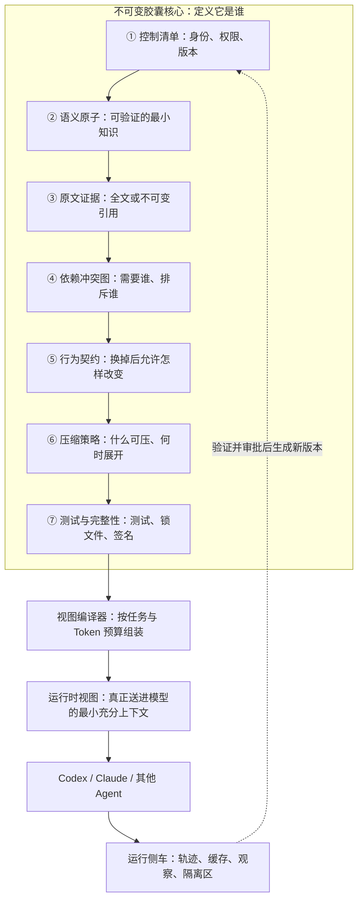
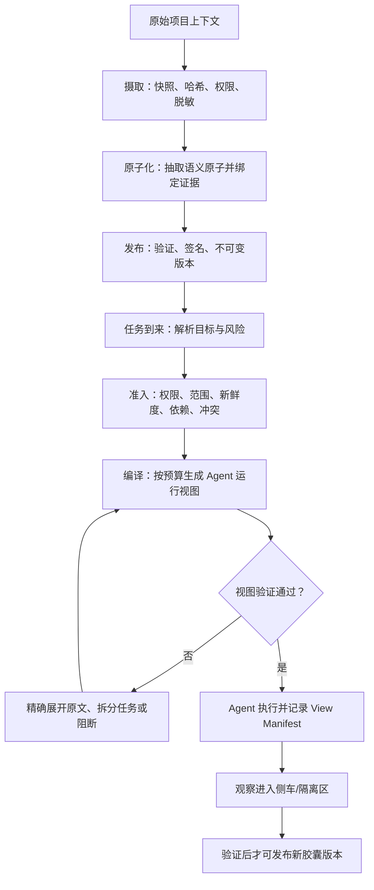

# ContractCapsule v2.1-Frozen

**中文名：可验证替换型上下文胶囊**  
**规范编号：CCS-2.1**  
**状态：设计冻结（Design Frozen）**  
**冻结日期：2026-07-30**  
**适用对象：Codex、Claude Code、其他 Coding Agent，以及后续 FSE 论文原型**

---

## 0. 最终结论

ContractCapsule 不是“把原文压成一段摘要”，也不是“给向量库里的文档加一些元数据”。

它是一个：

> **不可变、带原文证据、由语义原子组成、受行为契约约束、可按任务编译、可验证替换、可完整审计的项目上下文单元。**

最终方案采用“双轨制”：

1. **保存轨**：授权范围内的原始上下文全量、无损、不可被摘要覆盖地保存；代码仓库可用 `commit + path + content digest` 指向原文，无须在每个胶囊里复制整个仓库。
2. **使用轨**：运行时默认不把全量原文塞给模型，而是按风险和任务预算装配“语义原子 + 必要原文摘录 + 可展开证据句柄”；信息不足时，再精确展开原文。

因此，最终答案不是“全量原文”和“压缩文本”二选一，而是：

> **原文全量保真，运行视图按需精编；摘要只是一种可重建视图，永远不是事实源。**

---

## 1. 冻结边界

### 1.1 本次冻结的内容

- 胶囊定义与非目标；
- 胶囊内部七个必备模块；
- 原文保存与引用规则；
- 语义原子结构；
- 压缩等级与展开条件；
- 冷、温、热三层驻留方式；
- 胶囊解析、编译、注入、验证和观察流程；
- 版本、签名、权限、隔离和审计；
- 胶囊替换、双运行与回滚协议；
- 故障时的阻断或降级策略；
- Codex、Claude Code 等 Agent 的适配边界。

### 1.2 不属于 v2.1 核心规范的内容

- 某一种向量数据库、对象存储或云厂商；
- 某一个模型的私有 KV Cache 实现；
- 某一种前端 UI；
- 通过训练得到的不可读 soft prompt；
- 自动把 Agent 的每次输出直接写回正式胶囊；
- 对所有任务作“行为完全确定”的不现实承诺。

这些可以替换实现，但不能改变本规范的语义。

### 1.3 变更规则

从现在开始，`CCS-2.1` 是产品和论文实验的共同基线。任何结构性修改必须：

1. 提交设计变更记录；
2. 说明对兼容性、实验假设和安全性的影响；
3. 通过既有胶囊迁移测试；
4. 按语义化版本发布为新版本；
5. 不得就地修改已经发布的胶囊。

---

## 2. 一张图看懂胶囊内部



读图时只需记住三句话：

- **核心**保存“事实、来源和契约”，发布后不可变；
- **视图**是为某次任务临时编译出来的，可删除、可重建；
- **侧车**保存运行观察，但无权偷偷改写核心。

---

## 3. 三个物理载体应该怎样使用

过去用“CPU、内存、硬盘”类比 Agent 记忆时，最容易出现的误解是把 CPU 也当作存储。最终规范按以下方式处理：

| 载体 | 在 ContractCapsule 中的职责 | 放什么 | 不放什么 |
|---|---|---|---|
| CPU / GPU | 计算层 | 解析、权限检查、依赖求闭包、排序、视图编译、验证、推理 | 不作为胶囊事实源 |
| 内存 / Agent 上下文窗口 | 热层 | 当前目标、硬约束、选中的语义原子、少量精确摘录、证据句柄 | 不默认放全部原文、历史日志和全部依赖 |
| 本地盘 / 数据库 / 对象存储 | 冷层与温层 | 不可变核心、全量证据、版本、索引、编译缓存、审计 | 不把易失缓存当作唯一原文 |

“冷、温、热”是**驻留状态**，不是知识类别：

- **冷层**：不可变胶囊、原文证据、历史版本、测试和审计。容量大、加载慢、是事实源。
- **温层**：清单索引、依赖图、关键词/向量索引、验证缓存、已编译视图。可重建。
- **热层**：某一次 Agent 调用真正读取的运行时视图。容量最小、只保留任务所需内容。

同一个语义原子可以从冷层进入温层，再被编译进热层；这不会产生三个不同的“事实副本”，而是同一身份的不同驻留状态。

---

## 4. 胶囊的三个区域

### 4.1 A 区：不可变签名核心

这是胶囊本体，参与内容摘要和签名，决定胶囊身份。发布后只能读取，不能就地修改。

### 4.2 B 区：可重建派生物

包括 Agent 专用视图、关键词索引、Embedding、验证缓存等。它们：

- 不参与胶囊身份；
- 删除后可从核心重建；
- 必须记录生成它们的编译器、模型和策略版本；
- 不得反向覆盖核心。

把 Embedding 排除在胶囊核心之外，是因为 Embedding 会随模型版本变化，也不适合承担人类可审计的事实身份。

### 4.3 C 区：可变运行侧车

侧车记录：

- 本次为什么选中或排除某个原子；
- Token 使用量；
- 展开过哪些原文；
- 验证结果；
- 运行失败与使用频率；
- Agent 新发现但尚未验证的候选知识。

侧车可以更新，但候选知识只能进入隔离区。经过来源核验、测试和审批后，才能发布为一个新的不可变胶囊版本。

---

## 5. 不可变核心的七个必备模块

| # | 模块 | 主要内容 | 为什么必须存在 | 直接作用 |
|---|---|---|---|---|
| 1 | Control Manifest | 身份、版本、范围、权限、依赖、生命周期、摘要和签名引用 | 没有它就无法判断“这是谁、谁能用、何时能用” | 发现、准入、版本选择与权限治理 |
| 2 | Semantic Payload | 带类型、范围、模态和来源的语义原子 | 防止胶囊退化成“元数据 + 一段摘要” | 精确选择、解释、测试和替换 |
| 3 | Evidence Plane | 原文全文或不可变来源引用、内容摘要、精确位置 | 摘要会遗漏，必须能回到证据 | 审计、纠错、按需展开与新鲜度检查 |
| 4 | Dependency Graph | `requires`、`provides`、`conflicts` 和版本约束 | 单纯 Top-k 检索会漏掉必要前提 | 求依赖闭包、暴露冲突、阻止错误组合 |
| 5 | Replacement Contract | 目标行为、保护不变量、允许范围、测试和回滚条件 | “文件能换”不等于“行为安全地换” | 可验证替换和局部行为控制 |
| 6 | Compression Policy | 各类原子允许的压缩级别、预算和展开条件 | 不能让压缩器自行决定是否丢掉硬规则 | 风险感知编译与 Token 控制 |
| 7 | Tests & Integrity | 静态/行为/压缩测试、锁文件、校验和、签名 | 没有验证就无法可靠复现或激活 | 防篡改、复现、上线门禁与回滚依据 |

下面逐一展开。

---

## 6. ① Control Manifest：控制清单

建议文件：`manifest.json`

最小字段：

```json
{
  "spec_version": "CCS-2.1",
  "capsule_id": "com.example.auth-policy",
  "version": "2.3.0",
  "content_digest": "sha256:...",
  "owner": "team-auth",
  "tenant": "example",
  "scope": {
    "repositories": ["example/api"],
    "paths": ["src/auth/**"],
    "environments": ["dev", "staging", "prod"]
  },
  "authority": "approved-project-policy",
  "sensitivity": "internal",
  "provides": ["auth.jwt-policy/v2"],
  "requires": ["security.baseline@>=3,<4"],
  "conflicts": ["auth.legacy-session@<2"],
  "lifecycle": "PUBLISHED",
  "created_from": ["git:example/api@4f2c..."],
  "integrity": {
    "lock": "integrity/capsule.lock",
    "signature": "integrity/signature.json"
  }
}
```

设计原因：

- `capsule_id + version + digest` 三者共同防止“名字相同、内容不同”；
- `scope` 把知识限制在仓库、路径和环境内，防止跨项目污染；
- `authority` 和 `sensitivity` 在检索排序前执行，不能先检索后过滤；
- `provides/requires/conflicts` 让胶囊像带接口的软件组件，而不是松散文本；
- `created_from` 只记录构建来源，不代替逐原子的证据映射。

---

## 7. ② Semantic Payload：语义原子

建议文件：`payload/atoms.jsonl`

一个语义原子只表达一项可单独检查的承诺、事实、决策或操作规则。推荐字段：

```json
{
  "atom_id": "auth.jwt.access-token-ttl",
  "kind": "invariant",
  "statement": "生产环境的访问令牌有效期必须不超过 15 分钟。",
  "modality": "MUST",
  "scope": ["environment:prod", "path:src/auth/**"],
  "exceptions": [],
  "validity": {
    "from": "2026-07-01",
    "until": null
  },
  "authority": "approved-project-policy",
  "status": "validated",
  "confidence": 1.0,
  "evidence_refs": ["ev-auth-policy-17"],
  "requires_atoms": ["security.clock-skew-limit"],
  "conflicts_with": ["auth.jwt.legacy-ttl"],
  "sensitivity": "internal",
  "compression_class": "P0_EXACT",
  "refresh_policy": "on-source-change"
}
```

### 7.1 固定的原子类型

| 类型 | 简单解释 | 例子 |
|---|---|---|
| `policy` / `invariant` | 不允许被随意违反的规则 | 禁止把密钥写入日志 |
| `fact` | 可由来源验证的项目事实 | 服务使用 PostgreSQL 16 |
| `decision` | 已作出的架构选择及理由 | 认证采用 JWT 而非 Session |
| `procedure` | 有顺序的操作办法 | 数据库迁移步骤 |
| `interface` / `tool_contract` | API、函数或工具的输入输出约束 | `createUser` 的错误码 |
| `example` | 帮助理解但不具强制性的示例 | 合法配置样例 |
| `episodic_observation` | 某次运行的观察 | 某测试在特定提交上失败 |

### 7.2 固定规则

- 一条原子只表达一件可验证的事；
- 原子必须有范围，避免把局部事实误当全局事实；
- `confidence` 只表示不确定程度，不能替代来源和权限；
- 所有正式原子必须有至少一个证据引用；
- LLM 自动抽取的内容默认是候选原子，不得直接成为 P0/P1；
- 高权威规则必须由可信来源解析或人工审批；
- 原子内容变更会产生新版本，不能原位覆写。

这就是 ContractCapsule 不只是“带很多元数据的摘要”的关键：核心不是摘要段落，而是可单独选取、追溯、验证、依赖和替换的语义承诺集合。

---

## 8. ③ Evidence Plane：原文证据层

建议文件：`evidence/source-map.jsonl`

每个证据映射至少记录：

```json
{
  "evidence_id": "ev-auth-policy-17",
  "atom_ids": ["auth.jwt.access-token-ttl"],
  "source_type": "git",
  "uri": "git://example/api",
  "revision": "4f2c...",
  "path": "docs/security/auth.md",
  "locator": {
    "symbol_or_heading": "Access token lifetime",
    "start_line": 41,
    "end_line": 44,
    "span_digest": "sha256:..."
  },
  "blob_digest": "sha256:...",
  "captured_at": "2026-07-30T00:00:00Z",
  "retention": "follow-source-policy",
  "access_policy": "team-auth",
  "validation": "verified"
}
```

### 8.1 原文保存的最终规则

1. **任何有损摘要都不得覆盖原始证据。**
2. 对 Git 代码与文档，`repository + immutable commit + path + span digest` 就能作为权威原文，不必每个胶囊复制整个仓库。
3. 对网页、聊天、工具返回等易消失内容，在权限和保留政策允许时，将完整内容存入内容寻址存储（CAS）。
4. 对不能依法或依约复制的内容，只保存不可变 URI、内容摘要和访问策略；运行时取不到时，高风险任务必须阻断，不能假装证据仍可用。
5. 行号只用于显示；稳定定位要同时使用提交号、标题/符号锚点和内容摘要，因为行号会漂移。
6. 原文可用 gzip/zstd 等做**无损的存储压缩**，但这不会减少模型输入 Token，也不会降低运行时 KV Cache 压力。
7. 删除或失效的受保护来源应撤销相关胶囊；可保留不含原文的审计墓碑，但不得继续激活。

### 8.2 为什么不把所有原文直接送入模型

- 会占满上下文窗口；
- 增加首 Token 延迟和推理成本；
- 无关内容会降低注意力集中度；
- 原文中可能混有提示注入、旧版本或无权限信息；
- 全文存在不代表模型能正确找到关键规则。

所以，Evidence Plane 负责“完整可追溯”，View Compiler 负责“最小充分使用”。

---

## 9. ④ Dependency Graph：依赖与冲突图

建议文件：`graph/dependencies.json`

图中存在两种节点：

- 胶囊节点；
- 原子节点。

固定边类型：

- `requires`：没有它就不能正确使用；
- `provides`：对外提供的能力或语义接口；
- `conflicts`：不能同时激活；
- `replaces`：声明可替换目标及兼容范围；
- `optional`：有帮助，但预算不足时可以不加载。

固定执行规则：

1. 先做权限、范围、版本和新鲜度准入；
2. 再做相关性排序；
3. 选中原子后求强制依赖闭包；
4. 检查冲突；
5. 依赖闭包超出预算时，阻断或拆分任务，不能静默删除必需项。

这样可以修复普通 RAG 的一个核心问题：Top-k 可能取到“结论”，却漏掉结论成立的前提和例外。

---

## 10. ⑤ Replacement Contract：行为替换契约

建议文件：`contracts/replacement.yaml`

最小结构：

```yaml
contract_id: auth.jwt-policy.v2
replaces: auth.jwt-policy.v1
preconditions:
  - repository tests are green
target_effects:
  - access token TTL changes from 30m to 15m
protected_invariants:
  - refresh token flow remains backward compatible
  - audit logging remains enabled
allowed_scope:
  - src/auth/**
forbidden_spillover:
  - billing/**
verification:
  static:
    - make lint
  behavioral:
    - make test-auth
  differential:
    - tests/contracts/auth-noninterference.yaml
activation:
  risk: high
  approval_required: true
  safe_boundary: before-next-agent-action
rollback:
  pointer: auth.jwt-policy.v1
  compensating_action: revoke-new-tokens
```

### 10.1 它解决什么问题

强可替换性不是“把 A 文件换成 B 文件”，而是：

- 明确希望哪些行为改变；
- 明确哪些行为必须保持；
- 明确影响范围；
- 用测试证明替换满足契约；
- 不满足时能回到上一版本。

### 10.2 不能夸大的边界

- 胶囊可以原子地切换 Agent 后续使用的上下文版本；
- 胶囊无法自动撤销已经发送的邮件、付款、部署等不可逆外部动作；
- 对不可逆动作必须使用预检、沙箱、人工审批或补偿动作；
- LLM 行为有随机性，高风险双运行需要多次试验和统计阈值，不能声称形式化的绝对保证。

---

## 11. ⑥ Compression Policy：压缩与装配策略

建议文件：`policies/compression.yaml`

最终采用五级策略：

| 等级 | 内容 | 运行时处理 | 能否有损压缩 |
|---|---|---|---|
| P0 | 安全规则、强制约束、工具 Schema、关键不变量 | 精确表达，优先加载 | 否 |
| P1 | 当前任务事实、决策、接口与步骤 | 结构化原子，保守改写 | 仅允许经验证的结构化规范化 |
| P2 | 支持性证据 | 精确摘录 + 原文句柄，按需展开 | 可以选择摘录，不得伪造 |
| P3 | 历史、背景、案例 | 摘要 + 来源句柄 | 可以 |
| P4 | 临时日志、冗余观察 | TTL、聚合、预算不足时先丢弃 | 可以 |

示例策略：

```yaml
classes:
  P0_EXACT:
    rendering: exact
    lossy_compression: forbidden
    expansion: always_available
  P1_STRUCTURED:
    rendering: canonical_atom
    lossy_compression: validated_only
    expansion_triggers: [ambiguity, conflict, high_risk]
  P2_EVIDENCE:
    rendering: exact_excerpt_with_handle
    expansion_triggers: [model_request, validator_request, low_confidence]
  P3_SUMMARY:
    rendering: source_grounded_summary
    expansion_triggers: [missing_detail]
  P4_TRANSIENT:
    rendering: aggregate_or_drop
    ttl: 7d
```

### 11.1 Token 预算

运行视图预算定义为：

\[
B_{\text{view}} =
B_{\text{model-input}}
- B_{\text{system}}
- B_{\text{conversation}}
- B_{\text{tools}}
- B_{\text{safety-headroom}}
\]

其中安全余量用于后续工具返回、对话增长和输出规划，避免刚开始就把上下文窗口塞满。

分配顺序固定为：

1. P0 精确内容；
2. P1 任务相关原子及强制依赖闭包；
3. P2 必要证据摘录；
4. P3 背景摘要；
5. P4 最先丢弃。

如果 P0 与强制依赖本身已经超出预算，编译必须失败并要求拆分任务或换用更大窗口，不能静默压缩硬规则。

### 11.2 压缩验证门禁

运行时视图在注入模型前至少通过：

- P0 关键原子覆盖率为 100%；
- 每个注入原子都能回溯到证据；
- 强制依赖闭包完整；
- 未解决冲突已经显式展示；
- 原文展开句柄可用；
- Token 预算没有超限；
- 高风险任务的行为契约测试满足门槛。

最终方案不承诺一个固定的“全局压缩率”。压缩率是结果，不是安全目标；目标是在预算内最大化任务有效性，同时不丢失关键承诺。

---

## 12. ⑦ Tests & Integrity：测试与完整性

建议目录：

```text
tests/
├── static/          # Schema、字段、权限、依赖和冲突
├── behavioral/      # 目标行为与保护不变量
└── compression/     # 压缩前后关键承诺是否保留

integrity/
├── capsule.lock
├── checksums.sha256
└── signature.json
```

`capsule.lock` 至少固定：

- 所有胶囊及其精确版本和摘要；
- 原始代码或文档提交；
- 编译器版本；
- Agent 适配器版本；
- 压缩策略版本；
- 测试集版本；
- 用于实验复现的模型系列、参数与运行配置。

测试分工：

- **静态测试**检查“包是否结构正确”；
- **证据测试**检查来源是否存在、未漂移、摘要匹配；
- **压缩测试**检查关键承诺有没有被遗漏或反转；
- **行为测试**检查替换是否只改变允许改变的行为；
- **完整性检查**验证摘要和签名，防止篡改。

---

## 13. 最终包结构

```text
capsule/
├── manifest.json
├── payload/
│   └── atoms.jsonl
├── evidence/
│   └── source-map.jsonl
├── graph/
│   └── dependencies.json
├── contracts/
│   └── replacement.yaml
├── policies/
│   └── compression.yaml
├── tests/
│   ├── static/
│   ├── behavioral/
│   └── compression/
├── integrity/
│   ├── capsule.lock
│   ├── checksums.sha256
│   └── signature.json
└── evidence/blobs/       # 仅 Fat Export 可选携带
```

派生缓存不属于胶囊本体：

```text
cache/
└── compiled/<agent>/<profile>/
    ├── view.md
    └── view-manifest.json
```

运行侧车不属于胶囊本体：

```text
runtime/
├── activation-trace.jsonl
├── validation-cache.json
├── observations.jsonl
└── quarantine/
```

### 13.1 Thin Capsule 与 Fat Export

- **Thin Capsule**：携带结构化核心和不可变证据引用；适合正常协作与仓库内使用。
- **Fat Export**：额外打包获授权的证据 Blob；适合离线执行、归档或跨环境复制。

二者具有相同的语义原子和契约。Fat Export 不是另一种胶囊规范，只是更完整的传输形式。

---

## 14. 运行时编译流程



### 14.1 构建阶段

1. 获取源材料；
2. 检查访问权限与保留政策；
3. 对 Secret 和个人数据做隔离或脱敏；
4. 快照、计算摘要、记录版本；
5. 优先用确定性解析器处理代码、Schema 和配置；
6. LLM 可帮助抽取原子，但输出先进入候选区；
7. 建立 source-map；
8. 分类权威等级、敏感级别和压缩等级；
9. 检查依赖、冲突和契约；
10. 通过测试后签名并发布不可变版本。

### 14.2 运行阶段

1. 解析任务目标、仓库、路径、环境和风险；
2. **先准入后排序**：无权限、越界、过期和不兼容胶囊不能进入候选集；
3. 使用关键词、符号、图关系和可选 Embedding 进行混合检索；
4. 对入选原子求强制依赖闭包；
5. 依据压缩策略和 Token 预算编译运行视图；
6. 验证 P0、来源、依赖、冲突和预算；
7. 向 Agent 注入运行视图；
8. 保存 `view-manifest.json`；
9. 信息不足时按证据 ID 精确展开，而不是重新做模糊检索；
10. 执行结果进入侧车，不能直接改正式胶囊。

---

## 15. Runtime View Manifest：每次注入都必须解释

`view-manifest.json` 必须记录：

- 胶囊 ID、版本和摘要；
- 任务标识、租户、仓库和权限上下文；
- 选中了哪些原子；
- 排除了哪些候选原子；
- 每一项的选中或排除原因；
- 哪些内容保持精确、哪些被结构化、摘要或丢弃；
- 展开过哪些原文证据；
- 每个部分消耗多少 Token；
- 依赖闭包和冲突结果；
- 编译器、策略、适配器和模型系列版本；
- 验证结果与时间。

这份清单是“强可解释性”的直接载体。用户不仅能看到最终提示，还能知道它是怎样被组装出来的。

---

## 16. Agent 适配

ContractCapsule 的核心格式与 Agent 无关。适配器只负责把同一组运行时原子渲染成目标 Agent 可接受的形式，例如：

- Codex 的项目说明、任务上下文和工具边界；
- Claude Code 的项目指令和任务上下文；
- 本地 Agent 的 system/user/tool 分区；
- MCP Resource 或其他只读上下文接口。

固定规则：

- 适配器不拥有事实；
- 适配器不得修改语义原子；
- 同一输入、锁文件和适配器版本应生成可复现的 View Manifest；
- 编译缓存的键必须包含胶囊摘要、策略版本、适配器版本、租户和敏感级别；
- 缓存不可跨租户复用；
- 适配器升级后旧视图缓存失效并重新编译。

### 16.1 与 Prompt Cache / KV Cache 的关系

- Prompt Cache 复用完全相同的提示前缀计算，适合把稳定 Schema 和 P0 内容放在前面、动态任务内容放在后面；
- Prompt Cache 主要降低重复计算成本和延迟，不替代上下文选择，也不把长提示变短；
- KV Cache 是模型推理后端对注意力键值的缓存，SaaS Agent 通常不允许 ContractCapsule 直接管理；
- ContractCapsule 通过减少输入 Token、稳定前缀和避免重复原文来间接减轻压力，但不把“控制供应商内部 KV Cache”写进核心承诺。

---

## 17. 信任、安全和提示注入

### 17.1 固定信任等级

| 等级 | 来源 | 默认能力 |
|---|---|---|
| T0 | 已签名仓库策略、测试、Schema | 可经验证成为 P0/P1 |
| T1 | 已审批项目文档 | 可经验证成为 P0/P1 |
| T2 | Issue、聊天、工单、网页 | 默认作为证据数据，不得直接成为强指令 |
| T3 | Agent 生成或运行观察 | 只进隔离区 |

### 17.2 固定安全规则

- 外部检索文本默认是“数据”，不是“指令”；
- T2/T3 内容不能自行提升到 P0；
- 权限、租户、仓库、路径和敏感性过滤必须发生在相关性排序之前；
- Secret 不得进入可共享视图或日志；
- 传输和静态存储加密；
- 胶囊发布时计算内容摘要并签名；
- 审计日志采用追加式记录；
- 来源中的可疑指令以引用证据方式展示，不能混入 Agent 高权限指令区；
- 运行视图缓存必须按租户和权限隔离并设置 TTL。

---

## 18. 胶囊替换协议

替换只能发生在安全动作边界，例如“下一次 Agent 行动之前”，不能在一次工具调用执行到一半时切换。

固定步骤：

1. 解析候选胶囊的身份、摘要和签名；
2. 检查 `provides/requires/conflicts/replaces`；
3. 求新版本依赖闭包；
4. 对旧、新版本分别编译运行视图；
5. 运行静态测试和行为契约；
6. 高风险替换在沙箱、分支或工作树中双运行；
7. 比较目标行为变化与保护不变量；
8. 满足门槛后，以原子方式更新“活动版本指针”；
9. 保留旧版本以便回滚；
10. 对已经产生的外部副作用执行预定义补偿动作。

### 18.1 风险分级

- **低风险**：只改解释或示例，静态验证可通过；
- **中风险**：改变局部实现决策，需要行为测试；
- **高风险**：安全、生产、数据或工具权限，要求审批、沙箱和双运行；
- **不可逆风险**：外部发送、支付、部署、删除，必须额外预检和补偿计划。

---

## 19. 生命周期与版本

固定状态：

```text
DRAFT → VALIDATED → PUBLISHED → ACTIVE → DEPRECATED → REVOKED
```

固定语义化版本规则：

- `PATCH`：证据定位或文字纠正，且不改变语义与行为契约；
- `MINOR`：向后兼容地增加原子或 `provides`；
- `MAJOR`：改变强制规则、范围、依赖或替换契约。

已经 `PUBLISHED` 的版本不可变。纠错也要发布新版本。

---

## 20. 故障与降级策略

| 故障 | 最终行为 |
|---|---|
| 原文 Blob 缺失或摘要不匹配 | 不激活该胶囊 |
| 来源已变化或过期 | 重新验证；高风险任务在完成前阻断 |
| 权限不足或跨租户 | 在检索前剔除并记录 |
| 强制依赖缺失 | 编译失败 |
| 存在未解决冲突 | 展示冲突并阻断自动激活 |
| P0 被压缩遗漏 | 回退到精确原文；仍超预算则拆分任务 |
| 编译器或适配器版本不匹配 | 丢弃旧缓存并重新编译 |
| 检测到提示注入 | 作为证据数据隔离，不提升为指令 |
| Registry 暂时不可用 | 仅在本地拥有锁定版本、完整 CAS 和有效签名时继续；否则阻断 |
| 遥测服务不可用 | 安全执行可把日志暂存本地；安全、权限和契约验证不能跳过 |
| 双运行结果不稳定 | 增加重复次数并报告统计置信度，不自动宣称通过 |
| 外部动作不可逆 | 胶囊回滚只恢复后续上下文；依赖补偿动作处理外部影响 |

安全和完整性相关故障采用 **fail closed（失败即阻断）**。仅观察性遥测故障可以有限降级。

---

## 21. 生产组件

最终系统由以下服务或本地模块组成：

| 组件 | 职责 |
|---|---|
| Capsule Builder | 摄取、原子抽取、source-map、候选隔离 |
| Registry + CAS | 不可变核心、内容寻址证据、版本、权限和签名 |
| Resolver | 准入、相关性检索、依赖闭包和冲突处理 |
| View Compiler | Token 预算、压缩策略、Agent 适配与视图清单 |
| Capsule Validator | Schema、来源、完整性、压缩和行为契约验证 |
| Agent Adapter | 面向 Codex、Claude Code 或其他 Agent 的只读渲染 |
| Swap Controller | 快照、双运行、原子激活和回滚 |
| Trace & Audit | 选择理由、Token、展开、验证与执行轨迹 |
| Quarantine & Promotion | 候选知识隔离、审批和新版本发布 |

部署时可以：

- 单机原型采用文件系统 CAS + SQLite 元数据；
- 团队生产采用关系型 Registry + S3 兼容对象存储 + 独立索引；
- 无论底层产品怎样变化，都必须保持本规范的不可变性、内容寻址、准入顺序和审计接口。

---

## 22. 十二条不可违反的不变量

1. 发布后的胶囊核心不可变。
2. 有损摘要永远不能覆盖原文证据。
3. 运行视图必须能从核心与锁文件重建。
4. Agent 新发现的内容默认进入隔离区。
5. 权限、范围和新鲜度检查必须先于相关性排序。
6. 入选原子的强制依赖必须闭包。
7. P0 不能被静默删除或有损压缩。
8. 每个注入模型的正式原子都必须可追溯。
9. 胶囊替换只能发生在安全动作边界。
10. 不可逆外部动作必须有预检、审批或补偿方案。
11. Embedding、缓存和 Agent 视图不是胶囊事实身份。
12. 完整性、安全或行为契约验证失败时必须阻断激活。

---

## 23. 明确删除的不合理设计

最终版明确拒绝：

- 每个胶囊复制一整份代码仓库；
- 每次任务把胶囊全部原文塞进提示；
- 只保存摘要、不保存或引用原文；
- 把向量 Embedding 当作唯一知识；
- 让 Agent 自动覆写正在使用的胶囊；
- 先做向量 Top-k，再检查权限；
- 依赖缺失时继续“尽力猜测”；
- 用一个固定压缩率处理所有风险等级；
- 把 Prompt Cache 当作长期记忆；
- 声称可以直接控制云端模型的内部 KV Cache；
- 在工具调用进行中热切换；
- 声称胶囊回滚能自动撤销所有现实世界副作用；
- 用单次随机运行宣称替换“绝对安全”。

---

## 24. v2.1 的验收标准

只有同时满足以下条件，才能称为实现了 `ContractCapsule v2.1`：

- 能构建符合目录结构和 Schema 的胶囊；
- 正式原子全部绑定可验证证据；
- 能区分 P0–P4 并执行不同压缩策略；
- 能生成包含选择/删除理由和 Token 统计的 View Manifest；
- 能按 source-map 精确展开原文；
- 能验证依赖闭包与冲突；
- 能验证摘要没有遗漏 P0；
- 能将同一胶囊编译给至少两类 Agent；
- 能发布不可变版本并验证摘要/签名；
- 能完成一次受控替换、行为测试和指针回滚；
- 能证明未验证观察不会污染正式核心；
- 能在权限、证据、依赖或完整性失败时正确阻断。

---

## 25. 对“V2 是否满足要求”的最终回答

**此前的 V2 架构方向满足，但规范没有完全封死。**

本次冻结后的 `v2.1-Frozen` 已把缺少的五项硬要求变成正式构造：

| 原缺口 | v2.1 的固定落点 |
|---|---|
| 原文保存契约 | Evidence Plane + 不可变 CAS/引用规则 |
| 压缩策略文件 | `policies/compression.yaml` + P0–P4 |
| 运行时视图清单 | `view-manifest.json` |
| 按需精确展开 | `source-map` + evidence handle |
| 压缩验证机制 | `tests/compression/` + 注入前门禁 |

此外，v2.1 还补齐了生产系统必须具备但此前不够明确的内容：

- 三区域可变性边界；
- 信任等级和提示注入隔离；
- 版本、签名和锁文件；
- 多租户权限与缓存隔离；
- 不可逆外部动作的真实边界；
- 故障时 fail-closed 规则；
- Agent 适配器和供应商 KV Cache 的职责边界。

因此，从设计层面可以正式回答：

> **是。ContractCapsule v2.1-Frozen 已满足“强可解释、强可替换、原文可追溯、运行时节省上下文、可用于生产原型和论文实验”的要求。接下来不再修改核心构造，只实现、测量和用实验检验它。**

这里的“满足”是指设计规范完备，不代表代码和论文实验已经完成。

---

## 26. 主要依据

- OpenAI 官方 Prompt Caching 说明：缓存依赖精确前缀匹配，稳定内容应放在前、动态内容在后。  
  <https://developers.openai.com/api/docs/guides/prompt-caching>
- Anthropic 官方 Prompt Caching 说明：缓存复用提示前缀计算，用于降低重复处理时间和成本。  
  <https://platform.claude.com/docs/en/build-with-claude/prompt-caching>
- GitHub Copilot Memory：仓库事实携带代码引用，并针对当前分支验证后使用。  
  <https://docs.github.com/en/copilot/concepts/agents/copilot-memory>
- Context Codec：强调 typed、source-grounded semantic atoms、证据跨度与关键原子保留验证。  
  <https://arxiv.org/abs/2605.17304>
- Nano-Capsulator：证明自然语言 Capsule Prompt 可显著压缩，但其重点不是本规范的来源治理和行为替换契约。  
  <https://arxiv.org/abs/2402.18700>
- LongLLMLingua：查询感知的长上下文压缩基线。  
  <https://aclanthology.org/2024.acl-long.91/>
- KV Cache Compression：KV Cache 压缩属于模型推理系统的独立研究层。  
  <https://aclanthology.org/2024.findings-emnlp.266/>
- OCI Image Manifest：内容摘要、清单和内容寻址对象为不可变软件制品提供了成熟类比。  
  <https://github.com/opencontainers/image-spec/blob/main/manifest.md>
- SLSA Provenance：构建来源、可验证出处和供应链审计的成熟思路。  
  <https://slsa.dev/spec/v1.2/provenance>
- JSON Schema Draft 2020-12：可机器验证的结构 Schema。  
  <https://json-schema.org/draft/2020-12/json-schema-core>
- Model Context Protocol：Agent 与资源/工具之间的开放交互边界，可作为适配接口而非胶囊事实源。  
  <https://modelcontextprotocol.io/specification/latest>
